# Chat with your PDFs: A Local-first RAG CLI

A production-grade command-line application built to query long, complex PDF documents locally, quickly, and securely without uploading sensitive files to third-party services or relying on paid OpenAI API endpoints.

This architecture leverages **LangChain** for orchestration, **ChromaDB** for persistent local vector database storage, **HuggingFace Sentence-Transformers** for CPU-friendly zero-cost embeddings, and **Groq Cloud** (Llama 3.3 70B) for ultra-fast, grounded Q&A generation.

---

## Behind the Scenes (How it Works)

The overall data flow for ingestion and query processing is illustrated below:

```mermaid
flowchart TD
    subgraph Ingestion ["1. Processing the PDF (Offline)"]
        A[PDF Document] --> B[Extract text page-by-page]
        B --> C[Split into overlapping 1000-char chunks]
        C --> D[Embed chunks locally using sentence-transformers]
        D --> E[(Store in local ChromaDB folder)]
    end

    subgraph Query ["2. Asking a Question (Online)"]
        F[User Question] --> G[Convert question to vector]
        G --> H[Retrieve top 3 matching chunks from ChromaDB]
        H --> I[Package matching text + page numbers]
        I --> J[Send prompt to Groq API]
        J --> K[Llama 3.3 70B synthesizes answer]
        K --> L[Print answer + precise source citations]
    end
```



---

## Technical Highlights

- **Smart Text Chunking:** `RecursiveCharacterTextSplitter` configured with 1,000-character chunk sizes and 200-character overlaps to maintain semantic continuity across boundaries.
- **Zero-Cost Local Embeddings:** Uses `sentence-transformers/all-MiniLM-L6-v2` (~90MB model size) to generate dense vector representations on CPU, eliminating external embedding API fees.
- **Persistent Storage:** `ChromaDB` stores embeddings locally in `./chroma_db`, avoiding redundant document ingestion on subsequent runs.
- **Ultra-Fast LLM Inference:** Integrates `llama-3.3-70b-versatile` via Groq Cloud hardware acceleration for low-latency terminal interactions.
- **Grounded Responses & Source Citations:** Strict system prompt constraints prevent model hallucinations and enforce precise page-number citations for verification.
- **Query Response Latency Tracking:** Measures real-time context retrieval and LLM response generation timings for performance monitoring.

---

## Step-by-Step Implementation Guide

This guide walks through building this PDF Retrieval-Augmented Generation (RAG) system from scratch.

### Step 1: Project Setup and Dependencies

Create a project directory structure:

```text
PDF-RAG/
├── .env
├── .env.example
├── README.md
├── rag_pdf.py
└── requirements.txt
```

Define the dependencies in `requirements.txt`:

```text
langchain==1.3.4
langchain-community==0.3.30
langchain-core==1.4.2
langchain-groq==1.1.2
langchain-huggingface==1.2.2
sentence-transformers==5.5.1
chromadb==1.5.9
pypdf==6.13.1
python-dotenv==1.2.2
```

Initialize your virtual environment and install dependencies:

```bash
# Windows
python -m venv venv
venv\Scripts\activate
pip install -r requirements.txt

# macOS / Linux
python3 -m venv venv
source venv/bin/activate
pip install -r requirements.txt
```

Configure your environment variable template in `.env`:

```env
GROQ_API_KEY=gsk_your_actual_api_key_here
EMBEDDING_MODEL=sentence-transformers/all-MiniLM-L6-v2
CHROMA_DB_DIR=./chroma_db
CHUNK_SIZE=1000
CHUNK_OVERLAP=200
TOP_K=3
```

---

### Step 2: Document Ingestion and Semantic Splitting

Load the document page by page using `PyPDFLoader` and split it into manageable semantic chunks using `RecursiveCharacterTextSplitter`.

```python
from langchain_community.document_loaders import PyPDFLoader
from langchain_text_splitters import RecursiveCharacterTextSplitter

def load_and_chunk_pdf(pdf_path, chunk_size=1000, chunk_overlap=200):
    # Load pages with page-level metadata
    loader = PyPDFLoader(pdf_path)
    pages = loader.load()
    
    # Split text into overlapping segments
    text_splitter = RecursiveCharacterTextSplitter(
        chunk_size=chunk_size,
        chunk_overlap=chunk_overlap
    )
    chunks = text_splitter.split_documents(pages)
    return pages, chunks
```

---

### Step 3: Vector Embeddings and Local Persistence

Convert text chunks into vector representations using a HuggingFace transformer model and index them in a local Chroma vector database.

```python
from langchain_huggingface import HuggingFaceEmbeddings
from langchain_community.vectorstores import Chroma

def create_vector_store(chunks, db_dir="./chroma_db", model_name="sentence-transformers/all-MiniLM-L6-v2"):
    embeddings = HuggingFaceEmbeddings(model_name=model_name)
    vector_store = Chroma.from_documents(
        documents=chunks,
        embedding=embeddings,
        persist_directory=db_dir
    )
    return vector_store
```

---

### Step 4: Groq LLM & Grounded Prompt Engineering

Configure `ChatGroq` with a strict prompt template that forces the model to rely exclusively on the retrieved context and cite source pages.

```python
from langchain_groq import ChatGroq
from langchain_core.prompts import ChatPromptTemplate

def build_rag_chain(model_name="llama-3.3-70b-versatile"):
    llm = ChatGroq(model=model_name, temperature=0.1)
    
    prompt = ChatPromptTemplate.from_messages([
        ("system", (
            "You are a helpful assistant that answers questions based on the "
            "provided context. Each piece of context is labeled with its source "
            "number and page. In your answer, cite which sources you used "
            "(e.g., [Source 1], [Source 2]). If the answer is not in the context, "
            "say 'I don't have enough information to answer that based on the "
            "document.' Keep answers concise.\n\n"
            "Context:\n{context}"
        )),
        ("human", "{question}"),
    ])
    
    return prompt | llm
```

---

### Step 5: Query Execution and Citation Formatting

Perform similarity retrieval, build the source-labeled context string, execute the LLM chain, and render source citations with page numbers.

```python
def ask_question(vector_store, chain, question, top_k=3):
    retriever = vector_store.as_retriever(search_kwargs={"k": top_k})
    relevant_docs = retriever.invoke(question)
    
    if not relevant_docs:
        print("No relevant context found in the document.")
        return

    # Build labeled context
    context_parts = []
    for i, doc in enumerate(relevant_docs, 1):
        page_num = doc.metadata.get("page", 0)
        page_display = page_num + 1 if isinstance(page_num, int) else page_num
        context_parts.append(f"[Source {i} - Page {page_display}]\n{doc.page_content}")

    context_str = "\n\n".join(context_parts)
    response = chain.invoke({"context": context_str, "question": question})

    print(f"\nAnswer: {response.content}\n")
    print("--- Sources ---")
    for i, doc in enumerate(relevant_docs, 1):
        page_num = doc.metadata.get("page", 0)
        page_display = page_num + 1 if isinstance(page_num, int) else page_num
        snippet = doc.page_content[:150].replace("\n", " ")
        print(f"  [Source {i}] Page {page_display}: \"{snippet}...\"")
```

---

### Step 6: Interactive CLI and Shell Commands

Wrap the components in an interactive command-line interface using `argparse` and a REPL loop supporting internal utility commands (`info`, `help`, `clear`, `quit`).

```python
import argparse
import sys
import os
from dotenv import load_dotenv

def main():
    load_dotenv()
    if not os.getenv("GROQ_API_KEY"):
        print("Error: GROQ_API_KEY environment variable is missing.")
        sys.exit(1)

    parser = argparse.ArgumentParser(description="Local PDF RAG CLI")
    parser.add_argument("-p", "--pdf", type=str, help="Path to PDF file")
    parser.add_argument("-k", "--top-k", type=int, default=3, help="Top K sources")
    args = parser.parse_args()

    pdf_path = args.pdf or input("Enter PDF path: ").strip()
    pages, chunks = load_and_chunk_pdf(pdf_path)
    vector_store = create_vector_store(chunks)
    chain = build_rag_chain()

    while True:
        try:
            query = input("\nYour question: ").strip()
            if query.lower() in ("quit", "exit"):
                break
            if query.lower() == "clear":
                os.system("cls" if os.name == "nt" else "clear")
                continue
            if query:
                ask_question(vector_store, chain, query, top_k=args.top_k)
        except (KeyboardInterrupt, EOFError):
            break

if __name__ == "__main__":
    main()
```

---

## Installation & User Setup

### Prerequisites

- Python 3.9 or higher installed.
- A free Groq API key from [console.groq.com](https://console.groq.com/).

### Installation

1. **Clone the repository:**
   ```bash
   git clone https://github.com/your-username/PDF-RAG.git
   cd PDF-RAG
   ```

2. **Create and activate virtual environment:**
   ```bash
   python -m venv venv
   # Windows:
   venv\Scripts\activate
   # macOS/Linux:
   source venv/bin/activate
   ```

3. **Install dependencies:**
   ```bash
   pip install -r requirements.txt
   ```

4. **Configure environment variables:**
   ```bash
   cp .env.example .env
   ```
   Set your API key in `.env`:
   ```env
   GROQ_API_KEY=gsk_your_actual_key_here
   ```

---

## Running the Application

Start the interactive terminal session:

```bash
python rag_pdf.py
```

### CLI Arguments

Customize parameters via flags:

```bash
python rag_pdf.py -p metadata.pdf -k 5 -c 1200 -o 250
```

| Flag | Option | Description | Default |
|---|---|---|---|
| `-p` | `--pdf` | Path to target PDF file | Prompt user |
| `-k` | `--top-k` | Number of context chunks to retrieve | `3` |
| `-c` | `--chunk-size` | Character size per chunk | `1000` |
| `-o` | `--chunk-overlap` | Overlap characters between chunks | `200` |
| `-m` | `--model` | Groq LLM model identifier | `llama-3.3-70b-versatile` |
| `-e` | `--embedding-model` | HuggingFace embedding model | `sentence-transformers/all-MiniLM-L6-v2` |
| `-d` | `--db-dir` | Local vector database directory | `./chroma_db` |

### Interactive Commands

- `help` — Show command options.
- `info` — Display active document details, chunk count, and model configuration.
- `clear` — Clear terminal screen.
- `quit` / `exit` — Terminate session.

---

## Technical Rationale

- **Framework Choice (LangChain):** Decouples document loading, vector database integration, and LLM inference providers, making future infrastructure swaps seamless.
- **Local Storage (ChromaDB):** Operates locally without requiring server deployment or cloud vector storage setup.
- **Groq Inference Acceleration:** Provides low latency inference on Llama 3.3 70B, making command-line interaction fluid and instant.

